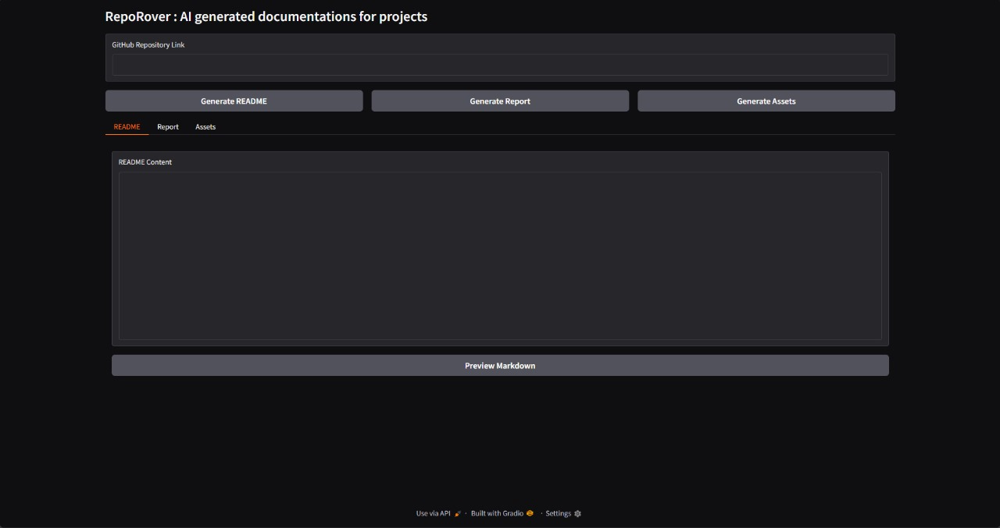
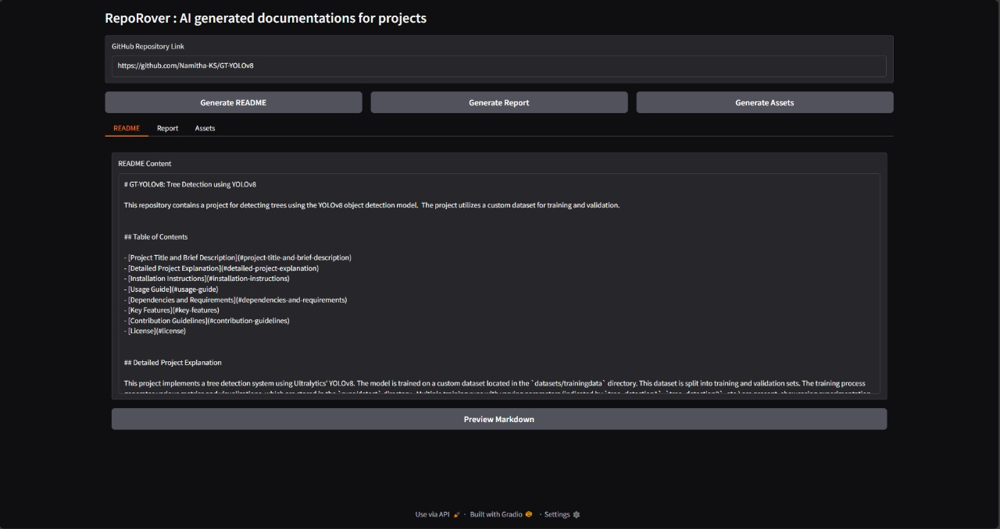

# RepoRover🎯

### Team Name: unSupervised

### Team Members
- Namitha - LBS Institute of Technology for Women

### Project Description
RepoRover is an AI-driven tool that automatically generates documentation for GitHub repositories. By simply providing a repository link, users can get a comprehensive README file, a detailed project report, and essential assets like system diagrams and GitHub workflow visuals. RepoRover aims to streamline the process of writing technical documentation, especially for developers, saving them time and effort.

### The Problem Statement
Many developers struggle with writing and maintaining comprehensive documentation for their GitHub repositories. RepoRover addresses this by automating the process, making it easier to focus on writing code rather than documentation.

### The Solution
RepoRover uses AI to analyze a GitHub repository and generates a structured README file, project report, and visual assets. It extracts the relevant details like project description, technologies used, and repository structure, and creates documentation in minutes, making the process much more efficient and fun!

## Technical Details
### Technologies/Components Used
For Software:
- **Languages used**: Python
- **Frameworks used**: Gradio (for UI), Gemini API (for content generation)
- **Libraries used**: GenAI (for AI content generation), PDF Generator, GitHub API (for repository scraping)
- **Tools used**: GitHub, Gradio, Python IDE

#### Installation
To get started, clone the repository and install the necessary dependencies:
```bash
git clone [insert repo link here]
cd RepoRover
pip install -r requirements.txt
```

#### Run
To run the application:
```bash
python main.py
```


#### Screenshots (Add at least 3)




### Project Demo
#### 

---
Made with ❤️ at TinkerHub

